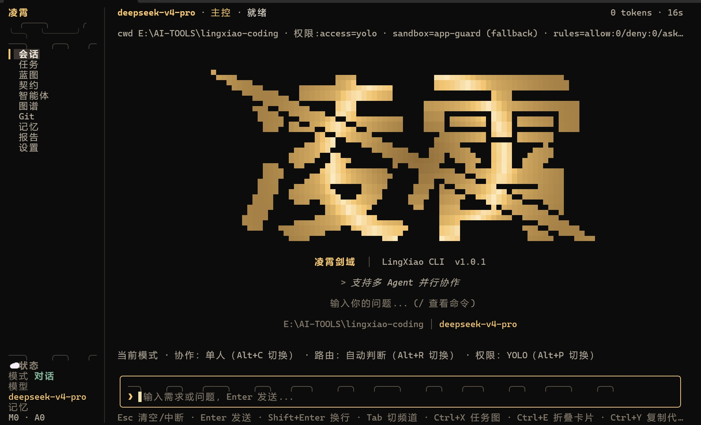
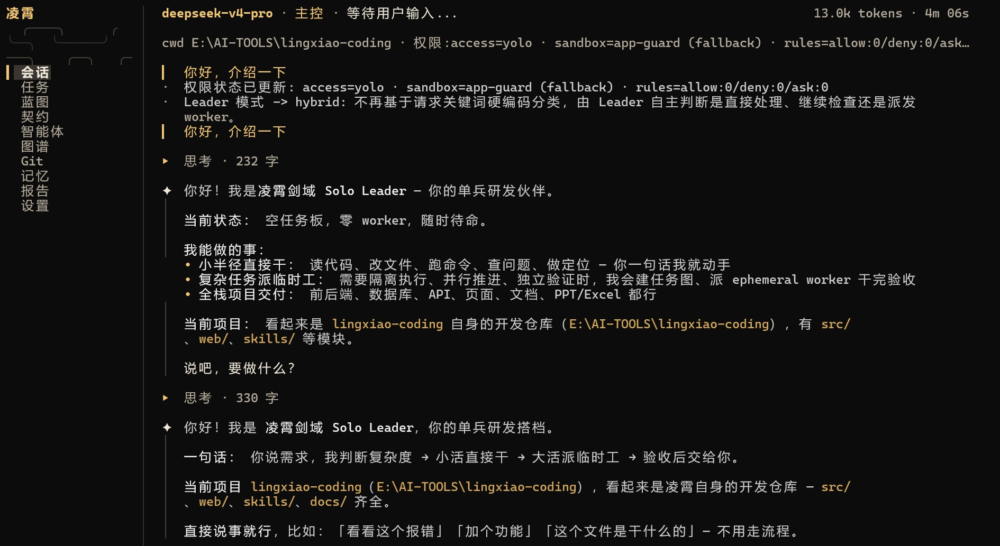
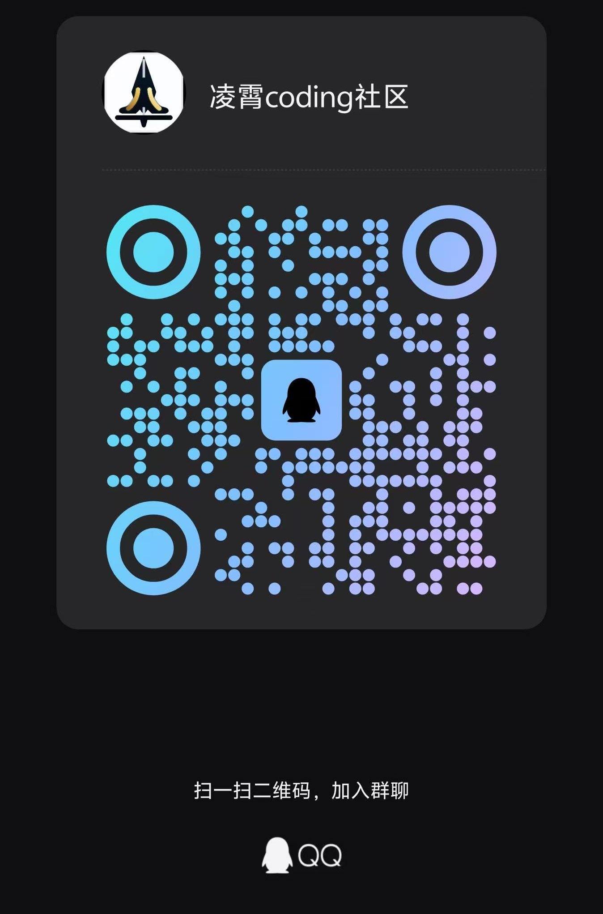

# LingXiao · 凌霄剑域

<p align="center">
  
</p>

> One sword cleaves the sky. Build what you envision.

[中文](./README.md) | [English](./README.en.md)


## Preface

There are plenty of AI coding tools out there, each with its own strengths. Through long-term use and practice, we've always had a small wish: could an AI tool act more like a seasoned tech lead — breaking down requirements, driving parallel execution, and keeping the entire process traceable?

**LingXiao** was born from that wish. It's an open-source multi-agent collaboration system — use it as a drop-in replacement for or supplement to existing tools, especially for medium-to-large projects.

Here's an overview of what it can do, how it works, and what the experience is like. Feedback, suggestions, and ideas are all welcome — let's learn and improve together.

[Product Site](https://hexian2001.github.io/lingxiao_website/) | [Repository](https://github.com/hexian2001/lingxiao-coding)

## Elevator Pitch

**LingXiao upgrades "chatting with AI" into "commanding an army of AI experts" — you set the goal, they do the work.**

How it works: the Leader Agent breaks down requirements, designs the plan, assembles an expert team, and delegates tasks. Worker experts run in parallel on frontend, backend, testing, documentation, Git operations, and more. The entire process is visible in real time through WebUI or TUI — every task's progress, tool invocation, and decision rationale is transparent and auditable, and you can intervene at any time.

## Interface at a Glance

<table>
  <tr>
    <td width="50%" align="center"><b>WebUI Task Board</b></td>
    <td width="50%" align="center"><b>WebUI Agent Panel</b></td>
  </tr>
  <tr>
    <td></td>
    <td></td>
  </tr>
  <tr>
    <td align="center"><b>TUI Terminal Interface</b></td>
    <td align="center"><b>WebUI Chat & Blackboard</b></td>
  </tr>
  <tr>
    <td></td>
    <td></td>
  </tr>
</table>

## Project Overview

### Project Structure

```
lingxiao-coding/
├── src/            # Backend source (TypeScript)
├── web/            # WebUI frontend (React + Vite)
├── scripts/        # Build / tooling scripts
├── skills/         # Skill packs
├── docs/           # Documentation & screenshots
├── assets/         # Static assets
├── package.json
└── LICENSE
```

### Tech Stack

- **Backend**: Node.js 24+, TypeScript, Fastify
- **Frontend**: React 19, Vite, Ink (TUI)
- **AI SDK**: OpenAI / Anthropic / Google / Amazon Bedrock
- **Toolchain**: Playwright, Sharp, Tesseract.js, MCP SDK

## Core Features

### A Team of Experts, Not a Single-Agent Monologue

- **Leader**: Commander-in-chief — understands objectives, breaks down tasks, builds the DAG, schedules experts, oversees completion.
- **Architect**: Architecture design, interface boundaries, module decomposition, risk management.
- **Backend**: Backend implementation — state machines, APIs, databases, task scheduling.
- **Frontend**: WebUI/TUI interaction, state projection, visualization workbench.
- **Researcher**: Research, solution comparison, external validation.
- **QA/Reviewer**: Testing, regression, code review, acceptance evidence.
- **Custom Roles**: Extend expert capabilities through role registration, the skill system, and tool permissions.

### Task DAG

Complex goals are decomposed by the Leader into a dependency graph of tasks. When each task is declared, the system automatically computes reverse edges to form a complete Directed Acyclic Graph. Three gates determine whether a task can execute: the Candidate Gate (task status is `dispatchable` with no blocking reasons), the Dependency Gate (all predecessor tasks are completed), and the Contract Gate (architecture contracts are ready). When a predecessor completes, blocked successor tasks are automatically unlocked to `dispatchable` — no manual scheduling required. The WebUI task panel visualizes the entire DAG: completed, running, blocked, and dependency lines — all at a glance.

### Full State Machine Synchronization

WebUI, TUI, and the backend runtime share a single EventEmitter as the event hub. SseBridge subscribes to 43 session-level events and 11 Agent-level events, routing them precisely to the correct frontend connection via `agentId→sessionId` mapping. `session:runtime_state` serves as the unified state snapshot for calibration — when the frontend reconnects or switches back, it restores from the snapshot directly rather than replaying events. Streaming events deliver real-time experience; state snapshots guarantee eventual consistency.

### Automatic Acceptance Loop

After each `implement` task completes, the system **automatically** creates an Evaluator verification task to assess the results across multiple dimensions (functional correctness, code quality, visual design, product depth). If verification fails, a Repair task is automatically generated; the Worker fixes the issues and the loop repeats until the task passes or hits the repair limit. This isn't a "remember to check" line in a prompt — it's a quality gate baked into the execution pipeline.

### Blackboard Knowledge Graph

Structured consensus among agents goes beyond simple chat history. Workers write facts, intents, design documents, contracts, review conclusions, and 8 other node types into a shared knowledge graph. The Leader reads and analyzes the graph every round, perceiving global progress and cognitive alignment. Agents don't pass messages — they align cognition through a structured graph.

### External Agent Driver

LingXiao ships with a Claude Code Driver and a Codex Driver that can launch the `claude` CLI or `codex` CLI as Worker subprocesses — injecting LingXiao Worker identity, parsing output as a stream, and collecting completion reports. This means you can use LingXiao as the commander and Claude Code or Codex CLI as the experts doing the actual work.

### Tool Plugins & MCP Ecosystem

A complete plugin system (plugin.json manifest, discovery, installation, contribution enumeration) supports injecting skills, MCP Servers, custom tools, and hooks (before/after intercepting and modifying tool calls). 80+ built-in tools cover file I/O, code search, AST queries, shell execution, browser automation, Git operations, HTTP requests, MCP integration, Office document generation, and more. Supports the skill system and MCP protocol extensions.

## Quick Start

### Prerequisites

```
- [Node.js](https://nodejs.org/) >= 24.0.0
- npm or a compatible package manager
```

### Install from Source

```bash
git clone https://github.com/hexian2001/lingxiao-coding.git
cd lingxiao-coding
npm install
npm run build
npm link
```

After installation, run directly in the terminal:

```bash
lingxiao
```

The first run will guide you through configuring your model and API key. Choose TUI mode or WebUI mode, set your goal, and LingXiao gets to work.

> Note: If the initial model and API key configuration fails, you can check and update them at `/root/.lingxiao/settings.json` (on Windows, it's `./lingxiao` under your user directory).



For detailed documentation, visit the [docs](https://hexian2001.github.io/lingxiao_website/getting-started/introduction/).

### Upgrade

```bash
lingxiao upgrade
```

Or manually:

```bash
cd lingxiao-coding
git pull
npm install
npm run build
```

## License & Contributing

This project uses an **AGPL v3 + Commercial Dual License** model: free for personal/open-source use, modifications must be open-sourced; if offered as a SaaS/API service, source code must be made available to users; for commercial closed-source use, please contact us for a commercial license (see [LICENSE](./LICENSE) for details).

Issues and PRs are welcome (please ensure your code passes `npm run build`, does not introduce hardcoded credentials or sensitive information, and follows the existing code style).

Commercial licensing inquiries: hexian2001@github.com

## Connect & Community

- **GitHub**: [hexian2001/lingxiao-coding](https://github.com/hexian2001/lingxiao-coding)
- **Issues**: [Submit bugs or feature requests](https://github.com/hexian2001/lingxiao-coding/issues)
- **Community**: Recognized and endorsed by the [LINUX DO Community](https://linux.do)

<p align="center">
  <br>
  Scan to join QQ/WeChat groups for latest updates, help, and developer discussions
</p>
