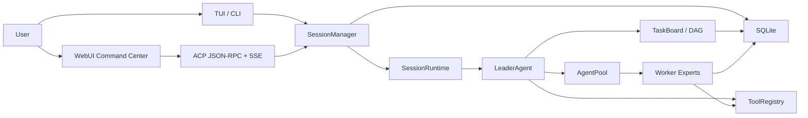

# LingXiao

<p align="center">
  
</p>

> One sword cleaves the sky — build what you envision.

Version: `1.0.0`


<p align="center"><sub>LingXiao WebUI Chat — thinking, tool calls, streaming output, full observability.</sub></p>


<p align="center"><sub>LingXiao TUI — synced with WebUI in real time, full orchestration from the terminal.</sub></p>

---

## Install

### macOS / Linux / WSL

```bash
curl -fsSL https://raw.githubusercontent.com/hexian2001/lingxiao-coding/main/scripts/install.sh | sh
```

### Windows (CMD / PowerShell)

```powershell
powershell -c "irm https://raw.githubusercontent.com/hexian2001/lingxiao-coding/main/scripts/install.ps1 | iex"
```

> No Node.js required. The script auto-detects platform and architecture, downloads the matching portable binary to `~/.lingxiao/bin`.

After installation, just run:

```bash
lingxiao            # Start — first run guides you through model and API key setup
```

Config file: `~/.lingxiao/settings.json`

---

## Upgrade

```bash
lingxiao upgrade          # Check and upgrade to latest
lingxiao upgrade --check  # Check only, no upgrade
```

---

## Quick Start

```bash
lingxiao            # Start TUI + WebUI
lingxiao list       # List all sessions
lingxiao --session <id>  # Resume a session
```

The terminal prints the WebUI URL. Port is written to `~/.lingxiao/port`.


---

## What It Is

LingXiao turns "chatting with a model" into "commanding an AI expert team."

You give a goal. The Leader decomposes, plans, builds a DAG, assembles expert workers, dispatches work, supervises progress, and closes the loop. Worker experts execute research, frontend, backend, testing, review, documentation, and Git in parallel. WebUI / TUI / backend share the same runtime state — observable, recoverable, auditable.

| Traditional Chat | LingXiao |
|:---|:---|
| Single assistant, single thread | Leader + Worker expert team |
| Flat conversation history | Dependency-aware task DAG |
| No real tool execution | File I/O, shell, Git, browser, terminal, MCP |
| State lost on refresh | SQLite-backed, recoverable sessions |
| Black-box decisions | Full audit trail: tasks, tools, evidence, verdicts |
| No parallelism | Independent tasks dispatched in parallel |

---

## Core Features

### Expert Team Runtime

| Role | Responsibility |
|:-----|:---------------|
| **Leader** | Goal understanding, task decomposition, DAG planning, dispatch, user confirmation, delivery |
| **Architect** | Architecture design, interface boundaries, module splitting, risk control |
| **Backend** | Backend implementation, state machines, APIs, databases, task scheduling |
| **Frontend** | WebUI/TUI interaction, state projection, visualization workbench |
| **Researcher** | Research, comparison, external verification |
| **QA/Reviewer** | Testing, regression, code review, acceptance evidence |
| **Custom** | Extend through role registration, skill system, and tool permissions |

### Task DAG Orchestration

```text
T-1 Requirements
  ├─ T-2 Architecture
  │    ├─ T-3 Backend implementation
  │    └─ T-4 Frontend implementation
  ├─ T-5 Verification
  └─ T-6 Docs & Release
```

- Independent tasks run in parallel
- Dependent tasks unlock in order
- Every task has owner, status, blockers, results, evidence
- Interrupted sessions recoverable

### WebUI Command Center

| Panel | Purpose |
|:------|:--------|
| **Chat** | Main control, tool calls, thinking, streaming output |
| **Tasks** | Task DAG visualization, status, dependencies, results, evidence |
| **Agents** | Worker panels, roles, runtime state, task binding |
| **Review** | Change evidence, file diffs, acceptance trails |
| **Git** | Version control workbench |
| **Blackboard** | Team memory, facts, intent, graph relationships |
| **Terminal** | In-browser terminal |
| **Settings** | Models, permissions, tools, plugins configuration |

### Real Tool Kernel

File I/O · Code search · Structured patches · Shell / Python / Terminal · Git workbench · Browser automation · Screenshots · OCR · Office/PPTX/DOCX/XLSX/PDF · Workflow canvas · MCP unified entrypoint

### Orchestration & Verification

- **Orchestration Runtime**: Task lifecycle events auto-trigger verdict extraction (PASS / FAIL / BLOCKED)
- **Speculative Execution**: Parallel implementation branches with `first_green` / `fewest_changes` / `fastest_tests` selection
- **Adversarial Verification**: Command-level breaker strategies with exit-code assertions + stdout/stderr evidence
- **Adaptive Orchestration**: Difficulty-signal-driven routing (cross-module deps, hotspot overlap, prior failures, impact ratio)
- **Contract Loop**: `contract → implement → evaluate → repair → reset`
- **Assumption Tracking**: Agents declare verifiable assumptions, auto-validated on code changes

### Persistent Memory

| Layer | Description |
|:------|:------------|
| **Long-term** | FTS5 + BM25 full-text search, 4 memory types (user / feedback / project / reference), auto-distillation |
| **Short-term** | Skill injection at worker dispatch, complementing long-term memory |

### Eternal Autonomous Mode

Leader self-patrol: IDLE → CHECK → PATROL → THINK → WAIT state machine, 30s base interval with exponential backoff, budget circuit breaker at 8 consecutive failures. EternalSupervisor provides 3-layer health check + auto-restart.

---

## Architecture



---

## Configuration

Config file: `~/.lingxiao/settings.json`

| Variable | Description |
|:---------|:------------|
| `LINGXIAO_LLM_PROVIDER` | `auto` / `openai` / `anthropic` |
| `LINGXIAO_OPENAI_API_KEY` | OpenAI or compatible API key |
| `LINGXIAO_OPENAI_BASE_URL` | OpenAI-compatible endpoint |
| `LINGXIAO_ANTHROPIC_API_KEY` | Anthropic key |
| `LINGXIAO_LEADER_MODEL` | Leader model |
| `LINGXIAO_AGENT_MODEL` | Worker model |
| `LINGXIAO_WEB_PORT` | Web server port |

Supports OpenAI, Anthropic, DeepSeek, Qwen, Moonshot/Kimi, Gemini-compatible, Groq, SiliconFlow, and other OpenAI-format services.

---

## Requirements

| Dependency | Requirement |
|:-----------|:------------|
| Node.js | Not required (portable binary included) |
| Git | Recommended |
| OS | Linux / macOS / Windows / WSL |

---

## Security

> ⚠️ LingXiao has real host capabilities: file read/write, shell execution, browser automation, Git operations, terminal access, workflow execution, external model calls, and worker task execution.

- The Web server token is local machine control. Do not expose an unprotected server.
- Never commit `.env`, API keys, Git tokens, or SQLite session databases.
- Supports Strict → Dev → Networked → Yolo permission modes.

---

## Tech Stack

Node.js 24 · Fastify · SQLite · React · Ink · Playwright · OpenAI · Anthropic

---

## Documentation

[Full Docs](https://hexian2001.github.io/lingxiao_website/)

---

## License

Proprietary. All rights reserved.

---

<div align="center">

**LingXiao** — One Sword Cleaves the Sky

Unauthorized copying, modification, or distribution prohibited.

</div>
