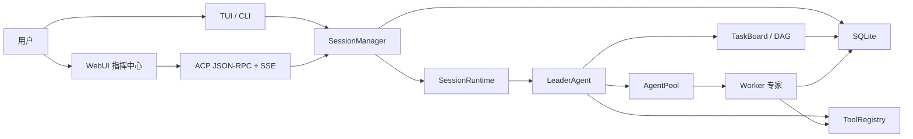

# 凌霄剑域 · LingXiao

<p align="center">
  
</p>

> 一剑开天，做你所想。

当前版本：`1.0.0`


<p align="center"><sub>凌霄 WebUI 对话面板：thinking、工具调用、流式输出，全链路可观测。</sub></p>


<p align="center"><sub>凌霄 TUI 终端界面：与 WebUI 实时同步，终端内完成全部编排操作。</sub></p>

---

## 一键安装

### macOS / Linux / WSL

```bash
curl -fsSL https://raw.githubusercontent.com/hexian2001/lingxiao-coding/main/scripts/install.sh | sh
```

### Windows PowerShell

```powershell
irm https://raw.githubusercontent.com/hexian2001/lingxiao-coding/main/scripts/install.ps1 | iex
```

> 无需 Node.js。脚本自动检测平台和架构，下载对应的便携二进制包到 `~/.lingxiao/bin`。

安装完成后直接运行：

```bash
lingxiao            # 启动，首次运行会引导配置模型和 API 密钥
```

配置文件：`~/.lingxiao/settings.json`

---

## 升级

```bash
lingxiao upgrade          # 检查并升级到最新版
lingxiao upgrade --check  # 仅检查，不升级
```

---

## 快速开始

```bash
lingxiao            # 启动 TUI + WebUI
lingxiao list       # 列出所有会话
lingxiao --session <id>  # 恢复指定会话
```

终端会打印 WebUI 地址，端口写入 `~/.lingxiao/port`。


---

## 它是什么

凌霄把"和模型聊天"升级成"指挥一个可观测、可恢复、可审查的 AI 专家团队"。

你给目标，Leader 负责判断、拆解、规划、建 DAG、组专家团、派发任务；Worker 专家并行执行研究、前端、后端、测试、审查、文档、Git 操作等工作；WebUI/TUI 实时同步完整运行态，所有任务、工具、权限、证据和会话状态都进入同一个工程内核。

| 传统聊天 | 凌霄 |
|:---|:---|
| 单助手、单线程 | Leader + Worker 专家团 |
| 扁平对话历史 | 依赖感知任务 DAG |
| 无真实工具执行 | 文件 I/O、Shell、Git、浏览器、终端、MCP |
| 刷新丢状态 | SQLite 持久化，可恢复会话 |
| 黑盒决策 | 全链路审计：任务、工具、证据、裁定 |
| 无并行 | 独立任务并行派发 |

---

## 核心特色

### 专家团运行时

| 角色 | 职责 |
|:-----|:-----|
| **Leader** | 目标理解、任务拆解、DAG 规划、专家调度、用户确认、交付 |
| **Architect** | 架构设计、接口边界、模块拆分、风险控制 |
| **Backend** | 后端实现、状态机、API、数据库、任务调度 |
| **Frontend** | WebUI/TUI 交互、状态投影、可视化工作台 |
| **Researcher** | 资料调研、方案比较、外部验证 |
| **QA/Reviewer** | 测试、回归、代码审查、验收证据 |
| **自定义角色** | 通过角色注册、技能系统和工具权限扩展 |

### 任务 DAG 编排

```text
T-1 需求澄清
  ├─ T-2 架构设计
  │    ├─ T-3 后端实现
  │    └─ T-4 前端实现
  ├─ T-5 测试验证
  └─ T-6 文档与发布
```

- 独立任务并行执行
- 依赖任务按序解锁
- 每个任务有 owner、状态、阻塞关系、结果、证据
- 中断可恢复

### WebUI 指挥中心

| 面板 | 用途 |
|:------|:-----|
| **Chat** | 主控交互、thinking、工具调用、流式输出 |
| **Tasks** | 任务 DAG 可视化、状态、依赖、结果、证据 |
| **Agents** | Worker 面板、角色、运行态、任务绑定 |
| **Review** | 变更证据、文件 diff、验收记录 |
| **Git** | 版本控制工作台 |
| **Blackboard** | 团队记忆、事实、意图、图谱关系 |
| **Terminal** | 浏览器内终端 |
| **Settings** | 模型、权限、工具、插件配置 |

### 真实工具内核

文件 I/O · 代码搜索 · 结构化补丁 · Shell / Python / 终端 · Git 工作台 · 浏览器自动化 · 截图 · OCR · Office/PPTX/DOCX/XLSX/PDF · Workflow 画布 · MCP 统一入口

### 编排与验证

- **编排运行时**：任务生命周期事件自动触发裁定提取（PASS / FAIL / BLOCKED）
- **投机执行**：并行实现分支，`first_green` / `fewest_changes` / `fastest_tests` 选择策略
- **对抗验证**：命令级破坏策略 + 退出码断言 + stdout/stderr 证据
- **自适应编排**：难度信号驱动路由（跨模块依赖、热点重叠、历史失败、影响面）
- **契约闭环**：`contract → implement → evaluate → repair → reset`
- **假设追踪**：Agent 声明可验证假设，代码变更后自动校验

### 持久记忆

| 层 | 说明 |
|:---|:-----|
| **长期记忆** | FTS5 + BM25 全文搜索，4 种记忆类型（用户/反馈/项目/参考），自动蒸馏 |
| **短期注入** | Worker 派发时注入执行知识，补充长期记忆 |

### Eternal 自治模式

Leader 自巡：IDLE → CHECK → PATROL → THINK → WAIT 状态机，30s 基础间隔指数退避，8 次连续失败预算熔断。EternalSupervisor 三层健康检查 + 自动重启。

---

## 架构



---

## 配置

配置文件：`~/.lingxiao/settings.json`

| 变量 | 说明 |
|:-----|:-----|
| `LINGXIAO_LLM_PROVIDER` | `auto` / `openai` / `anthropic` |
| `LINGXIAO_OPENAI_API_KEY` | OpenAI 或兼容 API 密钥 |
| `LINGXIAO_OPENAI_BASE_URL` | OpenAI 兼容端点 |
| `LINGXIAO_ANTHROPIC_API_KEY` | Anthropic 密钥 |
| `LINGXIAO_LEADER_MODEL` | Leader 模型 |
| `LINGXIAO_AGENT_MODEL` | Worker 模型 |
| `LINGXIAO_WEB_PORT` | Web 服务端口 |

支持 OpenAI、Anthropic、DeepSeek、Qwen、Moonshot/Kimi、Gemini 兼容、Groq、SiliconFlow 等 OpenAI 格式服务。

---

## 环境要求

| 依赖 | 要求 |
|:-----|:-----|
| Node.js | 不需要（便携二进制已内置） |
| Git | 推荐 |
| 系统 | Linux / macOS / Windows / WSL |

---

## 安全

> ⚠️ 凌霄具有真实主机能力：文件读写、Shell 执行、浏览器自动化、Git 操作、终端访问、工作流执行、外部模型调用和 Worker 任务执行。

- Web server token 是本机控制权，不要公开暴露未保护的服务。
- 不要提交 `.env`、API key、Git token、SQLite 会话库。
- 支持 Strict → Dev → Networked → Yolo 四级权限模式。

---

## 技术栈

Node.js 24 · Fastify · SQLite · React · Ink · Playwright · OpenAI · Anthropic

---

## 文档

[完整文档](https://hexian2001.github.io/lingxiao_website/)

---

## 许可证

Proprietary. All rights reserved.

---

<div align="center">

**LingXiao** — 一剑开天，做你所想

未经授权禁止复制、修改或传播

</div>
